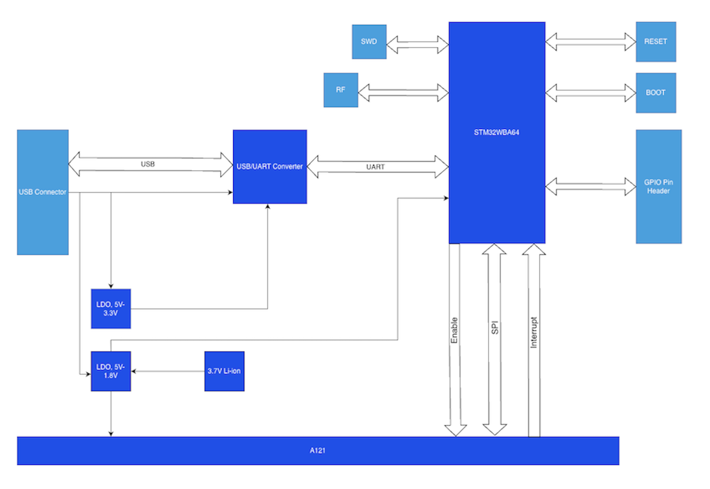
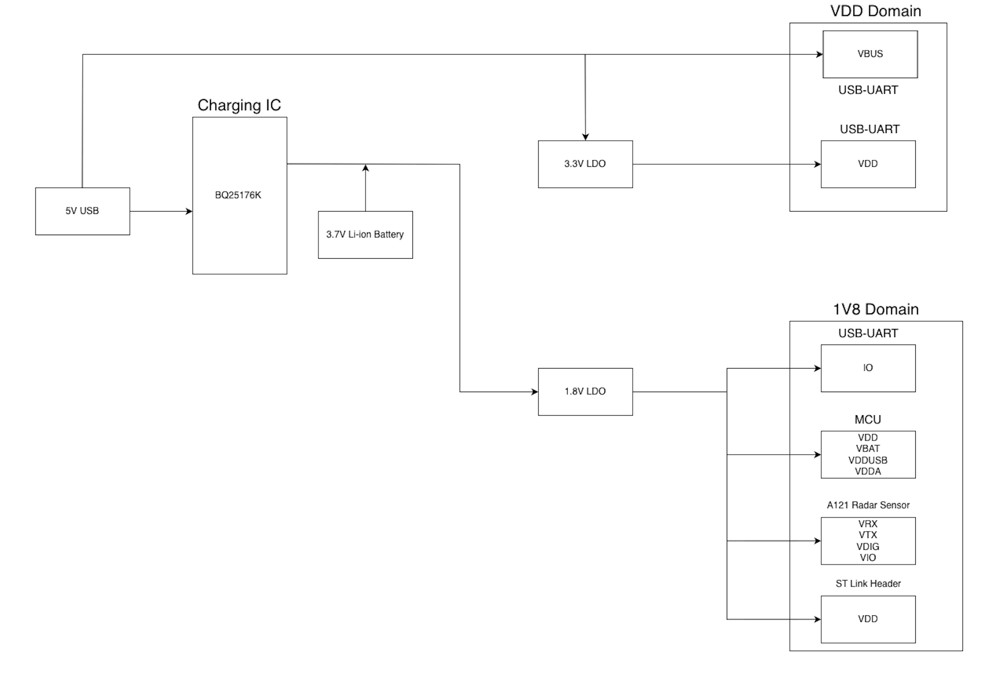
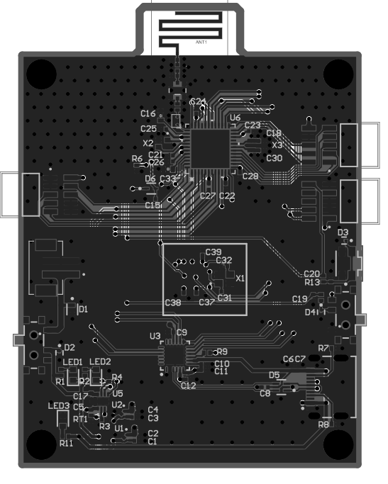

# Radar Sensor System — Reference Manual

---

## Table of Contents

1. [System Overview](#1-system-overview)
2. [Hardware](#2-hardware)
   - [2.1 Component Overview](#21-component-overview)
   - [2.2 STM32WBA64](#22-stm32wba64)
   - [2.3 Acconeer A121](#23-acconeer-a121)
   - [2.4 Power System](#24-power-system)
   - [2.5 PCB Layout](#25-pcb-layout)
   - [2.6 Debug Interface](#26-debug-interface)
3. [Firmware Architecture](#3-firmware-architecture)
   - [3.1 Source File Map](#31-source-file-map)
   - [3.2 UTIL_SEQ Cooperative Scheduler](#32-util_seq-cooperative-scheduler)
   - [3.3 Boot Sequence](#33-boot-sequence)
   - [3.4 State Variables](#34-state-variables)
4. [BLE Protocol](#4-ble-protocol)
   - [4.1 Service Overview](#41-service-overview)
   - [4.2 Control Service — FE40](#42-control-service--fe40)
   - [4.3 Vibration Service — FE70](#43-vibration-service--fe70)
   - [4.4 Vital Sign Service — FE50](#44-vital-sign-service--fe50)
   - [4.5 Start Sequence](#45-start-sequence)
   - [4.6 Notification Subscription](#46-notification-subscription)
   - [4.7 Current iOS App Implementation Status](#47-current-ios-app-implementation-status)
5. [Vibration Mode — Technical Reference](#5-vibration-mode--technical-reference)
   - [5.1 Signal Hierarchy: Pulse → Sweep → Frame](#51-signal-hierarchy-pulse--sweep--frame)
   - [5.2 Configuration Parameters](#52-configuration-parameters)
   - [5.3 Initialisation Sequence](#53-initialisation-sequence)
   - [5.4 Per-Frame Processing Loop](#54-per-frame-processing-loop)
   - [5.5 Signal Processing Algorithm](#55-signal-processing-algorithm)
   - [5.6 Post-Processing: Stability Filter and Output Gate](#56-post-processing-stability-filter-and-output-gate)
   - [5.7 Timing Summary](#57-timing-summary)
   - [5.8 Full Code Flow Reference](#58-full-code-flow-reference)
6. [Vital Signs Mode](#6-vital-signs-mode--technical-reference)
   - [6.1 Overview](#61-overview)
   - [6.2 Configuration Constants](#62-configuration-constants)
   - [6.3 Coarse Sweep](#63-coarse-sweep)
   - [6.4 Fine Measurement — Signal Processing Pipeline](#64-fine-measurement--signal-processing-pipeline)
   - [6.5 Breathing Rate Estimation](#65-breathing-rate-estimation)
   - [6.6 Heart Rate Estimation](#66-heart-rate-estimation)
   - [6.7 Output and BLE Notification](#67-output-and-ble-notification)
   - [6.8 Static Memory Footprint](#68-static-memory-footprint)
   - [6.9 Integration with radar_adapter.c](#69-integration-with-radar_adapterc)
7. [Fall Detection Mode](#7-fall-detection-mode--technical-reference)
   - [7.1 Overview](#71-overview)
   - [7.2 State Machine](#72-state-machine)
   - [7.3 Impact Detection (MODE_NORMAL)](#73-impact-detection-mode_normal)
   - [7.4 Confirmation Phase (MODE_SUSPECTED)](#74-confirmation-phase-mode_suspected)
   - [7.5 Alarm State (MODE_ALARM)](#75-alarm-state-mode_alarm)
   - [7.6 Configurable Parameters](#76-configurable-parameters-global_config)
   - [7.7 Internal Thresholds](#77-internal-thresholds-hardcoded-define)
   - [7.8 BLE Output](#78-ble-output)
   - [7.9 Integration with radar_adapter.c](#79-integration-with-radar_adapterc)
8. [iOS App](#8-ios-app)
   - [8.1 Project File Structure](#81-project-file-structure)
   - [8.2 RadarBLEManager](#82-radarbemanager)
   - [8.3 Data Models — RadarModels.swift](#83-data-models--radarmodelsswift)
   - [8.4 Vibration Dashboard — VibrationDashboard.swift](#84-vibration-dashboard--vibrationdashboardswift)
   - [8.5 Vital Signs Dashboard — VitalDashboard.swift](#85-vital-signs-dashboard--vitaldashboardswift)
   - [8.6 Fall Detection Dashboard](#86-fall-detection-dashboard)
   - [8.7 Shared UI Components](#87-shared-ui-components)

---

## 1. System Overview

This project is a **complete, open radar sensing platform** — custom PCB, STM32 firmware, Acconeer RSS integration, BLE GATT stack, and iOS companion app — built so that developers can take the full stack as a foundation and adapt it to their own sensing application with minimal rework.

At the core is the **Acconeer A121**, a 60 GHz pulsed coherent radar sensor in a 29 mm² package — one of the smallest and lowest-power radar sensors available, setting a new benchmark in both dimensions. The A121 is capable of far more than the applications demonstrated here: presence detection, velocity measurement, gesture recognition, material classification, water level sensing, robot navigation, and more can all be built on the same hardware and firmware infrastructure.

The two implemented sensing modes — vibration monitoring and vital signs detection — serve as concrete, end-to-end reference implementations covering the full signal path from raw IQ frames through STM32 processing, BLE streaming, and iOS display. They are designed to be studied, extended, or replaced.

### Architecture



### Current Application Modes

| Mode | What it measures | Status |
|---|---|---|
| Vibration | Dominant frequency (Hz), displacement (µm) at a configurable distance up to 1 m | Implemented |
| Vital Signs | Breathing rate (BPM), heart rate (BPM), distance (m) | Implemented |
| Fall Detection | Presence, sudden-drop event | Under development |

---

## 2. Hardware

### 2.1 Component Overview

The table below covers the key components. Not all passive components, decoupling capacitors, or supporting circuitry are listed — refer to the schematic for the complete BOM.

| Component | Part | Role |
|---|---|---|
| MCU | STM32WBA64 | Application processor + BLE radio |
| Radar sensor | Acconeer A121 | 60.5 GHz pulsed coherent radar |
| Charging IC | TI BQ25176K | Single-cell Li-ion charger via USB |
| Battery | 3.7 V Li-ion, 2000 mAh | Primary power source |
| 3.3 V LDO | NCP167BMX330TBG | Powers USB-UART converter (VDD domain) |
| 1.8 V LDO | NCP167AMX180TBG | Powers MCU, A121, debug header (1V8 domain) |
| USB-UART converter | CP2105 | Debug UART and USB connectivity |
| BLE antenna | PCB trace | 2.4 GHz RF |
| Microwave Coaxial Connector | MM8130 | RF debug and test

---

### 2.2 STM32WBA64

| Specification | Value |
|---|---|
| Core | Arm Cortex-M33 with TrustZone |
| CPU frequency | 100 MHz |
| Flash | Up to 2 MB |
| RAM | Up to 512 KB (including 64 KB with parity) |
| Wireless | Bluetooth Low Energy 5.4 |
| BLE TX power | +10 dBm (max) |
| BLE RX sensitivity | −96 dBm @ 1 Mbps |
| Supply voltage | 1.71 V – 3.6 V |
| Key peripherals | SPI, UART, USB HS OTG, 86 GPIO |
| Operating temperature | −40 °C to +105 °C |
| Package (this design) | UFQFPN or UFBGA (see PCB) |

**Role in this system:** runs the BLE GATT server, the Acconeer RSS SDK, all signal processing, and the UTIL_SEQ cooperative task scheduler. Communicates with the A121 over SPI2.

---

### 2.3 Acconeer A121

| Specification | Value |
|---|---|
| Technology | Pulsed Coherent Radar (PCR) |
| Operating frequency | 57 – 64 GHz |
| Maximum range | 23 m (water level with lens); up to 7 m human presence detection lens-free |
| Interface | SPI (up to 50 MHz) |
| Supply voltage | 1.8 V |
| IO power supply | 1.8 V or 3.3 V |
| Active current (MEASURE) | ~75 mA total at Profile 3 (VDIG 64.6 + VRX 5.9 + VTX 4.9 mA); ~74–78 mA across Profiles 1–5 |
| Between-sweep: DEEP_SLEEP | ~1.04 mA total (VDIG 922 µA + VIO 43 µA + VRX 34 µA + VTX 39 µA) |
| Between-sweep: SLEEP | ~1.51 mA total (VDIG 1.35 mA + VIO 43 µA + VRX 56 µA + VTX 60 µA) |
| Between-sweep: HIBERNATE | ~11.1 µA total (VDIG 11.0 + VIO 0.05 + VRX 0.03 + VTX 0.02 µA) |
| OFF current (ENABLE low) | ~0.4 µA total (VDIG 0.34 + VTX 0.06 µA; VIO and VRX = 0) |
| Operating temperature | −40 °C to +105 °C |
| Package | fcCSP50 (5.2 × 5.5 × 0.88 mm, 0.5 mm pitch) |

**Role in this system:** performs all mmWave signal generation and reception. Internally executes hardware-accelerated sweep averaging (HWAAS) before passing IQ data to the STM32 over SPI. Controlled via three GPIO lines from the STM32: **ENABLE** (sensor power gate), **SPI CS/CLK/MOSI/MISO** (data), and **INTERRUPT** (signals frame-ready to STM32).

**A121 GPIO connections to STM32:**

| Signal | Direction | Description |
|---|---|---|
| ENABLE | STM32 → A121 | Powers the sensor on/off (supply gating) |
| SPI (CS, CLK, MOSI, MISO) | Bidirectional | Data interface (SPI2 on STM32) |
| INTERRUPT | A121 → STM32 | Asserted when a sweep/frame is ready to read |

---

### 2.4 Power System

The device operates from a **3.7 V / 2000 mAh single-cell Li-ion battery**, charged via USB using the **TI BQ25176K** linear charger IC. The battery output feeds to 1.8V LDO regulator that create the 1.8 V power supply domain for the MCU and A121 radar. The 3.3V LDO regulator provides the 3.3 V power supply domain for the USB-UART converter.

**Power domain diagram:**

                                    

**Key power notes:**
- The A121 is fully powered off by pulling ENABLE low — idle draw drops to < 1 µA, which the firmware uses between monitoring sessions to save battery
- The BQ25176K does not expose a digital SoC (state of charge) interface; battery percentage is not available to the firmware

---

### 2.5 PCB Layout



<!-- The PCB is a single compact board with the following major areas:

| Reference | Component | Location |
|---|---|---|
| U6 | STM32WBA64 MCU | Top-center |
| X1 (boxed area) | Acconeer A121 radar | Center |
| ANT1 | PCB trace BLE antenna | Top edge |
| U3 | Power IC | Lower-center |
| U2, U5 | Supporting ICs | Lower-left |
| LED1, LED2, LED3 | Status LEDs | Lower-left |
| RT1 | Thermistor | Lower-left |
| X2, X3 | Crystals (MCU clocks) | Center-left |
| D3, D4 | Diodes | Right edge | -->


### 2.6 Debug Interface

The board exposes two debug interfaces:

| Interface | Connector | Use |
|---|---|---|
| ST-Link SWD | ST-Link header (VDD, SWDIO, SWDCLK, GND) | Flash firmware, hardware breakpoint debug |
| Standard COM Port | USB-UART converter (USB Connector) | `LOG_INFO_APP` printf-style debug output at runtime |
| Enhanced COM Port | USB-UART converter (USB Connector) | Flash firmware |

UART debug output is the primary runtime diagnostic tool. All key firmware events (mode changes, sensor init, calibration, per-frame results) are printed via `LOG_INFO_APP` and are visible in any serial terminal at the baud rate (115200 baud).

---

## 3. Firmware Architecture

### 3.1 Source File Map

The firmware is built on top of the STM32 WPAN middleware and the Acconeer RSS SDK. The application layer sits in `STM32_WPAN/App/`:

| File | Role |
|---|---|
| `Core/Src/main.c` | Entry point — hardware peripheral init, calls `MX_APPE_Init()` |
| `Core/Src/app_entry.c` | Application entry — calls `APP_BLE_Init()` |
| `STM32_WPAN/App/app_ble.c` | BLE stack init, GATT event routing, `Radar_Update_Timer` (50 ms), connect/disconnect handlers |
| `STM32_WPAN/App/radar_adapter.c` | **Core abstraction layer** — owns all Acconeer RSS API calls, sensor lifecycle, and per-mode processing |
| `STM32_WPAN/App/control_service_app.c` | Handles BLE writes to FE41 (mode) and FE42 (start/stop), owns `is_radar_running` flag and `Radar_Process_Task` |
| `STM32_WPAN/App/control_service.c` | GATT characteristic definitions for Control Service (FE40) |
| `STM32_WPAN/App/vibration_service_app.c` | Stores `Vibration_Config`, handles FE71 config writes, sends FE72 BLE notifications |
| `STM32_WPAN/App/vibration_service.c` | GATT characteristic definitions for Vibration Service (FE70) |
| `cortex_m33_gcc/examples/getting_started/vital_signs.c` | Vital signs algorithm — coarse sweep, IIR filters, LMS ANC, FFT, BPM estimation |
| `cortex_m33_gcc/examples/getting_started/fall_detector.c` | Fall detection state machine — impact detection, confirmation window, alarm |
| `cortex_m33_gcc/integration/` | Acconeer HAL integration — SPI, GPIO, sleep, interrupt wait |

**Acconeer SDK modules used:**

| Module | Purpose |
|---|---|
| `acc_rss_a121` | Core RSS init, HAL registration |
| `acc_sensor` | Sensor create/calibrate/prepare/measure/read/destroy |
| `acc_processing` | IQ data processing (raw buffer → complex IQ samples) |
| `acc_vibration` | Vibration algorithm — FFT, peak extraction, displacement calculation |
| `acc_detector_presence` | Presence detector used by vital signs and fall detection modes |

---

### 3.2 UTIL_SEQ Cooperative Scheduler

The firmware uses STM32's **UTIL_SEQ** cooperative scheduler — there is no preemption between application tasks. Tasks run to completion before the next one starts. The BLE stack events are processed inside `UTIL_SEQ_Run()`.

**Key entities:**

| Entity | Type | Period | Role |
|---|---|---|---|
| `Radar_Process_Task` | Task | On-demand | Calls `Radar_Adapter_Process()` — one full sensor frame per invocation |
| `Radar_Update_Timer` | Periodic timer | 50 ms | Fires `UTIL_SEQ_SetTask(radar_task)` — keeps measurements running |
| BLE HCI task | Task | Event-driven | Processes incoming BLE write commands (mode, config, start/stop) |

**Scheduling behaviour:**

```
50 ms timer fires
  └─ UTIL_SEQ_SetTask(radar_task)   ← marks task pending

UTIL_SEQ_Run() picks up radar_task
  └─ Radar_Process_Task()
       └─ Radar_Adapter_Process()
            └─ wait_for_sensor_interrupt()  ← blocks ~102 ms for vibration mode
                 └─ UTIL_SEQ_Run(HCI_ASYNCH_EVT) called inside the wait loop
                      └─ BLE write events (mode/config/start/stop) are processed here
                         while the sensor is acquiring a frame
```

The critical implication: the sensor's frame acquisition and BLE command processing are **interleaved inside `wait_for_sensor_interrupt`** — the CPU is never fully blocked from BLE events. However, a STOP command received mid-frame will not take effect until the current frame completes (~102 ms latency).

---

### 3.3 Boot Sequence

The following runs once at MCU power-on, before any phone connects:

```
main()
  ├─ Hardware peripheral init
  │    MX_GPIO_Init(), MX_SPI2_Init(), MX_USART1_UART_Init(), ...
  │
  └─ MX_APPE_Init()                          (app_entry.c)
       └─ APP_BLE_Init()                     (app_ble.c)
            │
            ├─ BLE stack + GATT server init
            │
            ├─ UTIL_TIMER_Create(Radar_Update_Timer, 50 ms, PERIODIC)
            │    └─ created but NOT started — starts only on BLE connect
            │
            ├─ CONTROL_SERVICE_APP_Init()    (control_service_app.c)
            │    ├─ CONTROL_SERVICE_Init()   ← register GATT service FE40
            │    ├─ Radar_Adapter_Init()
            │    │    ├─ acc_hal_rss_integration_get_implementation()
            │    │    └─ acc_rss_hal_register(hal)  ← RSS SDK ready to use SPI/GPIO
            │    └─ UTIL_SEQ_RegTask(radar_task, Radar_Process_Task)
            │
            ├─ VIBRATION_SERVICE_APP_Init()  (vibration_service_app.c)
            │    └─ VIBRATION_SERVICE_Init() ← register GATT service FE70
            │         └─ Vibration_Config initialised to defaults
            │              preset=HIGH, point=80, hwaas=16, profile=3, csm=OFF, db=OFF
            │
            └─ Start BLE advertising
```

**After boot:** the MCU is advertising and waiting for a phone to connect. The radar sensor is unpowered (`ENABLE` low, < 1 µA draw). No memory is allocated for sensor buffers yet — that happens in `init_vibration()` or `init_presence()` when the user taps START.

---

### 3.4 State Variables

Two global variables in `control_service_app.c` drive the runtime state machine:

| Variable | Type | Meaning |
|---|---|---|
| `current_radar_mode` | `uint8_t` | 0 = None, 1 = Vital, 2 = Fall, 3 = Vibration |
| `is_radar_running` | `uint8_t` | 0 = stopped, 1 = running |

`Radar_Process_Task` checks `is_radar_running` as its first instruction and returns immediately if it is 0 — this is how STOP takes effect without unregistering the task or stopping the timer.

---

## 4. BLE Protocol

### 4.1 Service Overview

The device exposes three GATT services. The iOS app discovers all three on connect and subscribes to notifications from status and data characteristics.

| Service | UUID | Purpose |
|---|---|---|
| Control Service | `0000FE40-CC7A-482A-984A-7F2ED5B3E58F` | Mode selection, start/stop, sensor status |
| Vibration Service | `0000FE70-CC7A-482A-984A-7F2ED5B3E58F` | Vibration config write, vibration data notify |
| Vital Sign Service | `0000FE50-CC7A-482A-984A-7F2ED5B3E58F` | Vital sign data notify |

---

### 4.2 Control Service — FE40

#### FE41 · Active Mode

| Field | Value |
|---|---|
| UUID | `0000FE41-8E22-4541-9D4C-21EDAE82ED19` |
| Properties | Write Without Response |
| Length | 1 byte |

| Byte | Meaning |
|---|---|
| `0x01` | Vital Sign mode |
| `0x02` | Fall Detection mode |
| `0x03` | Vibration mode |

Written before every START to tell the firmware which mode `Radar_Adapter_Start()` will initialise.

---

#### FE42 · System Command

| Field | Value |
|---|---|
| UUID | `0000FE42-8E22-4541-9D4C-21EDAE82ED19` |
| Properties | Write Without Response |
| Length | 1 byte |

| Byte | Meaning |
|---|---|
| `0x00` | STOP — sets `is_radar_running = 0`, calls `Radar_Adapter_Stop()` |
| `0x01` | START — sets `is_radar_running = 1`, calls `Radar_Adapter_Start(current_radar_mode)` |

---

#### FE43 · Sensor Status

| Field | Value |
|---|---|
| UUID | `0000FE43-8E22-4541-9D4C-21EDAE82ED19` |
| Properties | Notify |
| Length | 1 byte |

Lifecycle state notifications sent by the firmware. These are printed via `LOG_INFO_APP` and notified over BLE for diagnostic use — **not displayed in the iOS app UI**.

| Value | State |
|---|---|
| `0x00` | Powered Off |
| `0x01` | Initialized |
| `0x02` | Prepared |
| `0x03` | Measuring |
| `0x04` | Recalibrating |
| `0xFF` | Error |

---

### 4.3 Vibration Service — FE70

#### FE71 · Vibration Config

| Field | Value |
|---|---|
| UUID | `0000FE71-8E22-4541-9D4C-21EDAE82ED19` |
| Properties | Read, Write (with response) |
| Length | 10 bytes |

Written by the iOS app immediately before the START command. The firmware stores the payload in `Vibration_Config` and applies it inside `init_vibration()`.

**Byte layout (all multi-byte fields are little-endian):**

| Bytes | Field | Type | Notes |
|---|---|---|---|
| 0 | `preset` | `uint8_t` | 0 = High Frequency, 1 = Low Frequency |
| 1–4 | `measured_point` | `uint32_t` | Distance index; physical distance = `measured_point × 2.5 mm`. Range 1–400 (= 2.5 mm – 1000 mm). |
| 5–6 | `hwaas` | `uint16_t` | Hardware Accelerated Average Samples. Practical values: 8 / 16 / 32 / 64 / 128 / 256. |
| 7 | `profile` | `uint8_t` | Radar pulse profile 1–5. Higher = longer pulse, better SNR at range. |
| 8 | `continuous_sweep_mode` | `uint8_t` | 0 = OFF, 1 = ON. Ignored (forced ON) when `preset = 1`. |
| 9 | `double_buffering` | `uint8_t` | 0 = OFF, 1 = ON. Ignored (forced ON) when `preset = 1`. |

**Default values (applied at boot):**

| Field | Default |
|---|---|
| `preset` | 0 (High Frequency) |
| `measured_point` | 80 (= 200 mm) |
| `hwaas` | 16 |
| `profile` | 3 |
| `continuous_sweep_mode` | 0 (OFF) |
| `double_buffering` | 0 (OFF) |

---

#### FE72 · Vibration Data

| Field | Value |
|---|---|
| UUID | `0000FE72-8E22-4541-9D4C-21EDAE82ED19` |
| Properties | Notify |
| Length | 28 bytes |

Sent by the firmware after each processed frame that passes the stability and displacement gates. All values are IEEE 754 `float32`, little-endian.

| Bytes | Field | Unit | Notes |
|---|---|---|---|
| 0–3 | `frequency` | Hz | Dominant vibration peak frequency |
| 4–7 | `displacement` | µm | Peak displacement at `frequency` |
| 8–11 | `displacement_rms` | µm | RMS displacement (= peak / √2) |
| 12–15 | `velocity` | mm/s | Peak velocity (= displacement × ω / 1000) |
| 16–19 | `velocity_rms` | mm/s | RMS velocity |
| 20–23 | `acceleration` | m/s² | Peak acceleration (= displacement × ω² / 1×10⁶) |
| 24–27 | `acceleration_rms` | m/s² | RMS acceleration |

The iOS app currently reads only bytes 0–3 (`frequency`) and 4–7 (`displacement`). The remaining fields are computed and sent by the firmware for future use.

If the signal does not meet the stability gate (`stability_counter ≥ 3` AND `displacement > 5 µm`), the firmware sends a zero-value packet to clear the phone display.

---

#### FE73 · Spectrum Array

| Field | Value |
|---|---|
| UUID | `0000FE73-8E22-4541-9D4C-21EDAE82ED19` |
| Properties | Notify |
| Length | 240 bytes |

Reserved for future FFT spectrum streaming (frequency vs. displacement array). **Not used in the current firmware or iOS app.**

---

### 4.4 Vital Sign Service — FE50

#### FE52 · Vital Sign Data

| Field | Value |
|---|---|
| UUID | `0000FE52-8E22-4541-9D4C-21EDAE82ED19` |
| Properties | Notify |
| Length | 12 bytes |

Sent by the firmware after each processed vital sign frame. All values are IEEE 754 `float32`, little-endian.

| Bytes | Field | Unit |
|---|---|---|
| 0–3 | `breathing_rate` | Breaths per minute |
| 4–7 | `heart_rate` | Beats per minute |
| 8–11 | `distance` | Metres |

---

### 4.5 Start Sequence

Settings changed in the iOS UI are held in local app state only — they are not sent to the MCU immediately. They are applied exactly once, at the moment the user taps **START MONITOR**:

```
User taps START
      │
      ├─ 1. Write mode byte → FE41  (Write Without Response)
      │        value: 0x01 = Vital / 0x02 = Fall / 0x03 = Vibration
      │
      ├─ 2. Write config → FE71  (Write With Response, 10 bytes)   ← Vibration mode only
      │        [preset(1) | measured_point(4 LE) | hwaas(2 LE) | profile(1) | csm(1) | db(1)]
      │
      └─ (200 ms delay — ensures both writes arrive and are stored before START)
           │
           └─ 3. Write start command → FE42  (Write Without Response)
                    value: 0x01 = START
```

The 200 ms gap is required because FE41 and FE71 use different write types (no-response vs. with-response). Without the delay, the START command can arrive before the config has been stored by the firmware.

**Stop sequence** is a single write: `0x00 → FE42`. Any settings change while the sensor is running has no effect on the MCU until the next start cycle.

---

### 4.6 Notification Subscription

The iOS app enables notifications on two characteristics immediately after service/characteristic discovery:

| Characteristic | What triggers a notification |
|---|---|
| FE43 (Sensor Status) | Each lifecycle state transition in the firmware |
| FE72 (Vibration Data) | Each processed vibration frame (~10 fps, 100 ms period) |
| FE52 (Vital Sign Data) | Each processed vital sign frame |

Notifications are disabled automatically when the BLE connection drops; the firmware's periodic timer is also stopped at that point (`UTIL_TIMER_Stop` in the disconnect handler in `app_ble.c`).

---

### 4.7 Current iOS App Implementation Status

The firmware exposes more data and accepts more control parameters than the iOS app currently uses. The table below documents what is wired up in the current release versus what is defined but not yet consumed.

#### Characteristics

| Char | Firmware exposes | iOS app (current) | Notes |
|---|---|---|---|
| FE41 | Mode selection (Vital / Fall / Vibration) | Used — Vital and Vibration | Fall mode byte sent but dashboard is a placeholder |
| FE42 | START (0x01) / STOP (0x00) | Used | |
| FE43 | Sensor lifecycle state (7 values) | Subscribed, not displayed | Visible in STM32 debug UART log only |
| FE71 | Full 10-byte vibration config | Used — all 6 fields written on START | |
| FE72 | 28 bytes — 7 float32 metrics | Partially used | Only `frequency` (bytes 0–3) and `displacement` (bytes 4–7) shown in the UI; `displacement_rms`, `velocity`, `velocity_rms`, `acceleration`, `acceleration_rms` are received but discarded |
| FE73 | 240-byte FFT spectrum array | Not used | Reserved for future frequency-vs-displacement chart |
| FE52 | 12 bytes — 3 float32 vital metrics | Used — all 3 fields displayed | `breathing_rate`, `heart_rate`, `distance` all shown on Vital Signs dashboard |

#### Mode-Specific Configuration (Phone → Sensor)

| Mode | Config characteristic | iOS app (current) |
|---|---|---|
| Vibration | FE71 — preset, range, HWAAS, profile, CSM, DB | All parameters implemented in settings panel |
| Vital Signs | None defined yet | No config sent — `start_m`, `end_m`, sensitivity and other parameters are under development |
| Fall Detection | None defined yet | Mode is a placeholder — no config or live data |

---

## 5. Vibration Mode — Technical Reference

### 5.1 Signal Hierarchy: Pulse → Sweep → Frame

Understanding the three levels of signal acquisition is essential for reasoning about any vibration parameter.

```
Pulse
  └─ One transmitted mmWave burst + one received echo
     Produced entirely inside A121 silicon (invisible to the STM32)

Sweep
  └─ One averaged sample delivered to STM32 over SPI
     A121 fires N pulses internally (N = HWAAS), averages them, returns one result
     Random noise partially cancels; real reflections add coherently → +3 dB per doubling of HWAAS

Frame
  └─ sweeps_per_frame sweeps stacked into a time-series buffer
     Handed to acc_vibration_process() for FFT analysis
     frame_period ≈ sweeps_per_frame / sweep_rate
```

**High Frequency preset (default):** 1024 sweeps at 10 000 Hz sweep rate → frame period ≈ 102 ms (~10 fps).  
**Low Frequency preset:** 20 sweeps at 200 Hz sweep rate → frame period ≈ 100 ms (~10 fps).

The FFT is computed over the time series of IQ phase values at `measured_point`. Frequency resolution = `sweep_rate / time_series_length` = 10 000 / 1024 ≈ **9.8 Hz** for High Frequency preset, and 200 / 1024 ≈ **0.2 Hz** for Low Frequency preset.

---

### 5.2 Configuration Parameters

#### User-Controlled (sent over FE71)

| Parameter | Type | Default | Range | Effect |
|---|---|---|---|---|
| `preset` | enum | HIGH | HIGH / LOW | Loads the locked parameters below. Must be set first; overrides follow. |
| `measured_point` | uint32 | 80 | 1 – 400 | Distance index to monitor. Physical distance = `measured_point × 2.5 mm` (point 80 = 200 mm, point 400 = 1000 mm). Sets the **centre** of the detection bin — the target does not need to be at the exact distance; see range bin tolerance note below. |
| `hwaas` | uint16 | 16 | 8 / 16 / 32 / 64 / 128 / 256 | Hardware-averaged samples per sweep. Each doubling adds ~+3 dB SNR. Use higher values for longer detection distances. |
| `profile` | uint8 | 3 | 1 – 5 | Radar pulse duration. Higher profile = longer pulse = better SNR at range. Also widens the range bin — see tolerance note below. |
| `continuous_sweep_mode` | bool | OFF (HIGH) | ON / OFF | Forces uniform inter-sweep intervals. Required for accurate FFT at low frequencies. Always ON in LOW preset. |
| `double_buffering` | bool | OFF (HIGH) | ON / OFF | Prevents CPU readout from stalling the sweep stream. Must be paired with CSM. Always ON in LOW preset. |

> **Range bin tolerance.** `measured_point` sets the centre of a range bin whose width is determined by `profile`. The target does not need to be at the exact set distance — it only needs to fall somewhere within the bin. Approximate bin widths per profile (derived from `d_res ≈ c × t_pulse / 2` — verify exact values against the A121 User Guide at developer.acconeer.com):
<!-- >
> | Profile | Range bin width (approx.) | Effective tolerance around `measured_point` |
> |---|---|---|
> | 1 | ~4 cm | ±2 cm |
> | 2 | ~7 cm | ±3.5 cm |
> | 3 | ~12 cm | ±6 cm |
> | 4 | ~19 cm | ±9.5 cm |
> | 5 | ~25 cm | ±12.5 cm |
>
> An object set at 0.2 m with Profile 3 (default) will be reliably detected anywhere from roughly 0.1 m to 0.3 m without adjusting `measured_point`. This tolerance widens with higher profiles. For multi-object environments, a wider bin also increases the risk of capturing an unintended reflector at a nearby distance. -->

#### Locked / Hardcoded per Preset

| Parameter | High Frequency | Low Frequency | Notes |
|---|---|---|---|
| `sweep_rate` | 10 000 Hz | 200 Hz | Sets Nyquist frequency (max detectable = sweep_rate / 2: 5000 Hz or 100 Hz) |
| `sweeps_per_frame` | 1024 | 20 | Keeps frame rate at ~10 fps for both presets |
| `time_series_length` | 1024 | 1024 | FFT input length; freq. resolution = sweep_rate / 1024 |
| `lp_coeff` | 0.5 | 0.8 | Low-pass filter coefficient applied to the IQ phase time series |
| `low_frequency_enhancement` | false | true | Boosts weak low-frequency FFT components |
| `amplitude_threshold` | 100.0 | 100.0 | Minimum signal amplitude to report a peak |
| `frame_rate` | 0 (unconstrained) | 0 | Sensor runs as fast as hardware allows |
| `inter_frame_idle_state` | READY | READY | No power saving between frames |
| `inter_sweep_idle_state` | READY | READY | No power saving between sweeps |

#### CSM and Double Buffering — Preset Policy

```c
// radar_adapter.c — init_vibration()
if (preset == ACC_VIBRATION_PRESET_LOW_FREQUENCY) {
    ctx.vib_config.continuous_sweep_mode = true;   // always forced ON
    ctx.vib_config.double_buffering      = true;   // always forced ON
} else {
    ctx.vib_config.continuous_sweep_mode = (cfg->continuous_sweep_mode != 0);
    ctx.vib_config.double_buffering      = (cfg->double_buffering != 0);
}
```

LOW_FREQUENCY always forces both ON regardless of what the iOS app sends. HIGH_FREQUENCY passes user values through. The iOS UI reflects this by locking both toggles to ON (greyed out) when the Low Frequency preset is selected.

---

### 5.3 Initialisation Sequence

Called from `Radar_Adapter_Start(RADAR_MODE_VIBRATION)` when the START command (FE42 = 0x01) is received.

```
init_vibration()
  │
  ├─ 1. Read Vibration_Config from vibration_service_app (stored when FE71 was written)
  │
  ├─ 2. acc_vibration_preset_set(&ctx.vib_config, preset)
  │       Loads all locked parameters for HIGH or LOW into ctx.vib_config
  │
  ├─ 3. Apply user overrides
  │       ctx.vib_config.measured_point          ← hard overwrite
  │       ctx.vib_config.hwaas                   ← hard overwrite
  │       ctx.vib_config.profile                 ← hard overwrite
  │       ctx.vib_config.continuous_sweep_mode   ← preset policy (see above)
  │       ctx.vib_config.double_buffering        ← preset policy
  │       ctx.vib_config.reported_displacement_mode ← always AMPLITUDE
  │
  ├─ 4. acc_vibration_handle_create(&ctx.vib_config)  → ctx.vib_handle
  │
  ├─ 5. acc_processing_create(sensor_config, &ctx.proc_meta)  → ctx.processing
  │
  ├─ 6. acc_rss_get_buffer_size() + acc_integration_mem_alloc()  → ctx.buffer
  │
  ├─ 7. sensor_supply_on() + sensor_enable()  (ENABLE line pulled high → A121 powers up)
  │
  ├─ 8. acc_sensor_create(SENSOR_ID)  → ctx.sensor
  │
  └─ 9. do_sensor_calibration_and_prepare()
          ├─ acc_sensor_calibrate() loop  (waits for INTERRUPT each iteration)
          └─ acc_sensor_prepare()
```

After this sequence completes, `UTIL_SEQ_SetTask(radar_task)` is called to kick off the first measurement frame immediately, without waiting for the 50 ms timer.

---

### 5.4 Per-Frame Processing Loop

Runs inside `Radar_Adapter_Process(RADAR_MODE_VIBRATION)`, called once per `Radar_Process_Task` invocation.

```
acc_sensor_measure(ctx.sensor)
  └─ Commands the A121 to begin acquiring sweeps_per_frame sweeps

acc_hal_integration_wait_for_sensor_interrupt(SENSOR_ID, 1000 ms timeout)
  └─ Blocks the task until the A121 asserts its INTERRUPT line (frame ready)
     Duration: ~102 ms for High Frequency preset (1024 sweeps ÷ 10 000 Hz)
     BLE events are still processed during this wait via UTIL_SEQ_Run() inside the loop

acc_sensor_read(ctx.sensor, ctx.buffer, ctx.buffer_size)
  └─ DMA transfers the completed frame from A121 into ctx.buffer over SPI2

acc_processing_execute(ctx.processing, ctx.buffer, &proc_result)
  └─ RSS IQ processing: raw ADC samples → complex IQ time series
     proc_result.calibration_needed? → re-calibrate and skip frame

acc_vibration_process(&proc_result, ctx.vib_handle, &ctx.vib_config, &result)
  └─ FFT on the IQ phase time series at measured_point
     → result.peak_frequencies[]    (Hz)
     → result.peak_displacements[]  (µm, reported as amplitude)
     → result.peak_count
```

---

### 5.5 Signal Processing Algorithm

This section explains what happens mathematically inside `acc_processing_execute` and `acc_vibration_process` — the two RSS calls that turn a raw frame buffer into a vibration frequency and displacement reading.

#### Step 1 — Raw IQ Data

The A121 radar measures the echo of each transmitted pulse as a **complex IQ (In-phase + Quadrature) sample**. For a given range point, the IQ value encodes both the amplitude and the phase of the reflected signal:

```
IQ sample = I + jQ
  amplitude = sqrt(I² + Q²)   ← signal strength at that distance
  phase     = atan2(Q, I)     ← encodes the round-trip distance to the target
```

`acc_processing_execute` handles this conversion from the raw DMA buffer into a structured array of complex IQ values indexed by range point. The result is `proc_result`, which contains one complex IQ value per range point per sweep in the frame.

#### Step 2 — Phase Extraction at `measured_point`

Vibration mode focuses on a **single range point** (`measured_point`). The displacement of the target from one sweep to the next causes the round-trip distance to change slightly, which shifts the phase of the IQ sample at that point.

The relationship between phase change and physical displacement:

```
Δphase = (4π × Δdistance) / λ

where λ = c / f_radar = 3×10⁸ m/s / 60.5×10⁹ Hz ≈ 5 mm (carrier wavelength)
```

A 1 µm displacement produces a phase shift of roughly **0.0025 rad** — small but measurable with coherent radar. This is why the A121 can detect sub-millimetre vibrations.

`acc_vibration_process` extracts the phase at `measured_point` from each sweep in the frame, building a **phase time series** of length `sweeps_per_frame` (1024 for High Frequency preset).

#### Step 3 — Phase Unwrapping and Low-Pass Filtering

The raw phase is bounded to **[−π, π]**. When the target moves more than λ/4 ≈ 1.25 mm in one inter-sweep interval, the phase wraps around and produces a false discontinuity. The algorithm unwraps the phase by detecting and correcting these jumps, reconstructing the true continuous displacement waveform.

A **low-pass filter** (coefficient `lp_coeff`) is then applied to the unwrapped phase time series to suppress high-frequency electronic noise before the FFT step. The `lp_coeff` defaults differ by preset:

| Preset | `lp_coeff` | Reason |
|---|---|---|
| High Frequency | 0.5 | Less smoothing — fast signals need less filtering |
| Low Frequency | 0.8 | More smoothing — slow signals need stronger noise rejection |

#### Step 4 — FFT → Frequency and Displacement

An FFT is computed over the filtered phase time series. Each frequency bin in the output corresponds to a vibration frequency; the magnitude of each bin is proportional to the displacement amplitude at that frequency.

```
frequency_resolution = sweep_rate / time_series_length

High Frequency preset: 10 000 / 1024 ≈ 9.8 Hz per bin
Low Frequency preset:    200 / 1024 ≈ 0.2 Hz per bin

max_detectable_frequency = sweep_rate / 2   (Nyquist)
High Frequency preset: 5000 Hz
Low Frequency preset:   100 Hz
```

`acc_vibration_process` identifies peaks in the FFT output and converts their bin magnitudes back to displacement in µm, returning `result.peak_frequencies[]` and `result.peak_displacements[]`.

The `low_frequency_enhancement` flag (ON for Low Frequency preset) applies additional gain to the lower FFT bins to compensate for the natural roll-off that makes slow, small-amplitude signals harder to detect.

#### Summary of the Full Chain

```
A121 raw buffer (IQ samples, 1024 sweeps × N range points)
  │
  ├─ acc_processing_execute()
  │    └─ Raw ADC → complex IQ values per sweep per range point
  │
  └─ acc_vibration_process()
       ├─ Extract phase time series at measured_point  (atan2 on each sweep's IQ)
       ├─ Unwrap phase  (correct ±π jumps)
       ├─ Low-pass filter  (lp_coeff)
       ├─ FFT  (length = time_series_length = 1024)
       ├─ Peak detection  (find dominant frequency bins)
       └─ Convert bin magnitude → displacement (µm)
            → result.peak_frequencies[]
            → result.peak_displacements[]
```

---

### 5.6 Post-Processing: Stability Filter and Output Gate

This layer sits above the signal processing algorithm in `radar_adapter.c`. Once `acc_vibration_process` has returned peak frequencies and displacements, the firmware applies its own application-level filter before sending anything over BLE — raw FFT results are never sent directly to the phone.

```
Frame arrives with result.peak_count > 0
  │
  ├─ Frequency stability check:
  │    |current_freq - prev_freq| < 0.5 Hz  →  stability_counter++
  │    else                                 →  stability_counter = 0
  │
  └─ Pass gates?  stability_counter ≥ 3  AND  current_displacement > 5 µm
       │
       ├─ YES → compute derived metrics and send BLE notification:
       │          ω            = 2π × freq
       │          velocity     = displacement × ω / 1000         (µm·rad/s → mm/s)
       │          acceleration = displacement × ω² / 1 000 000   (µm·rad²/s² → m/s²)
       │          rms values   = peak / √2
       │          VIBRATION_APP_UpdateData(freq, disp, disp_rms, vel, vel_rms, accel, accel_rms)
       │               └─ VIBRATION_SERVICE_UpdateValue(FE72)  ← BLE notify → phone
       │
       ├─ NO (was previously stable) → send one zero packet to clear the phone display
       │          VIBRATION_APP_UpdateData(0, 0, 0, 0, 0, 0, 0)
       │
       └─ NO (was already unstable) → do nothing
```

**Gate logic summary:**

| Condition | Effect |
|---|---|
| Frequency stable for ≥ 3 consecutive frames AND displacement > 5 µm | Normal output — BLE notify with live data |
| Below threshold or unstable, previously was stable | One zero notify sent to clear the app display |
| Below threshold or unstable, already cleared | Silent — no BLE write |

**Debug log output** (printed every 20 frames ≈ 1 second via `LOG_INFO_APP`):

```
[VIB RAW] peaks=1  #0: freq=120.45 Hz  disp=38.20 um  stability=5/3  disp_ok=YES
[FILTERED VIB] Freq=120.45 Hz  Disp=38.20 um  Vel=28.92 mm/s  Accel=21881.34 m/s^2
```

---

### 5.7 Timing Summary

| Parameter | High Frequency | Low Frequency |
|---|---|---|
| Sweep rate | 10 000 Hz | 200 Hz |
| Sweeps per frame | 1024 | 20 |
| Frame acquisition time | ~102 ms | ~100 ms |
| Effective output rate | ~10 fps | ~10 fps |
| Max detectable frequency | 5000 Hz | 100 Hz |
| FFT frequency resolution | ~9.8 Hz | ~0.2 Hz |
| Min detectable frequency | ~10 Hz | ~0.2 Hz |

The 50 ms `Radar_Update_Timer` fires **twice per frame acquisition period**. The second `SetTask` call while the task is blocking in `wait_for_sensor_interrupt` simply re-marks the task pending — it does not stack or queue a second execution. Effective throughput is **one frame per ~102 ms**, not 20 Hz.

---

### 5.8 Full Code Flow Reference

The complete end-to-end code flow for a vibration session — from phone connect through start, measurement loop, stop, and disconnect — is documented in [`radar_code_flow.md`](../radar_code_flow.md).

---

## 6. Vital Signs Mode — Technical Reference

### 6.1 Overview

The vital signs mode estimates **breathing rate (9–42 BPM)** and **heart rate (54–180 BPM)** from the unwrapped phase of the presence detector's locked range bin. It operates in two sequential phases to minimise warm-up latency:

1. **Coarse sweep (~6.4 s):** Collects 128 frames simultaneously across all active candidate range bins, runs a 128-point FFT on each, and selects the closest bin whose heartbeat-band SNR exceeds a minimum threshold.
2. **Fine measurement (continuous):** Runs a full sliding-window spectral analysis on the single locked bin, producing a new BPM estimate every 10 new samples (~0.5 s once the circular buffer is full).

All vital signs logic lives in [`vital_signs.c`](../cortex_m33_gcc/examples/getting_started/vital_signs.c) and [`vital_signs.h`](../cortex_m33_gcc/examples/getting_started/vital_signs.h).

---

### 6.2 Configuration Constants

| Parameter | Value | Defined in |
|---|---|---|
| `SAMPLE_RATE_HZ` | 20 Hz | `app_config.h` |
| `FFT_N` | 512 | `app_config.h` — fine FFT size (zero-padded) |
| `WINDOW_LEN` | 128 samples | `vital_signs.c` — fine circular buffer (6.4 s) |
| `COARSE_N` | 128 frames | `vital_signs.h` — coarse sweep depth |
| `COARSE_MAX_CANDS` | 64 slots | `vital_signs.h` — max candidate range bins |
| `BPM_HIST_N` | 5 | `vital_signs.c` — median filter history depth |
| Breathing band | 0.15 – 0.70 Hz | 9 – 42 BPM |
| Heart band | 0.90 – 3.00 Hz | 54 – 180 BPM |
| HP filter alpha | 0.9845 | fc ≈ 0.05 Hz at dt = 0.05 s |
| LMS order | 16 taps | delay = 10 samples |
| LMS step size µ | 0.002 | normalised; hard-capped at 0.05 |
| LMS weight decay | 0.999 | Leaky NLMS — prevents long-term drift |
| PSD IIR alpha | 0.5 | ~1 s time constant |

---

### 6.3 Coarse Sweep

The coarse sweep runs once at session start before the fine filter locks in.

```
vital_signs_coarse_start()
    Zero coarse_buf[COARSE_MAX_CANDS][COARSE_N]; set coarse_fill = 0

Per presence frame (driven by radar_adapter.c):
    vital_signs_coarse_feed(slot, angle)    ← store unwrapped phase for each candidate bin
    vital_signs_coarse_tick()               ← increment frame counter; returns true at frame 128

When tick returns true:
    vital_signs_coarse_pick_best(n_candidates)
        For each slot 0..n_candidates-1:
            Remove DC (subtract mean over 128 samples)
            128-point in-place radix-2 FFT
            breathing SNR = peak_power / avg_power in [0.15, 0.70] Hz
            heart SNR     = peak_power / avg_power in [0.90, 3.00] Hz
            Log bins where either SNR > 1.2
        Return the closest slot where heart SNR > 1.5
        Return -1 if no slot qualifies

    vital_signs_replay_coarse(best_slot)
        For each of the 128 stored frames:
            apply_hp() → apply_butterworth_b() → store in distance_history_b[]
            apply_hp() → apply_butterworth_h() → store in distance_history_h[]
        Force slide_counter = 10 so the fine FFT fires on the very next frame
```

**Purpose of the replay:** Seeding the fine filter's circular buffer with coarse data eliminates the 6.4 s cold-start wait for the fine FFT. Results are available almost immediately after the coarse sweep completes.

---

### 6.4 Fine Measurement — Signal Processing Pipeline

Called as `process_vital_signs(difference, current_dist)` on every frame from the presence detector.

```
Unwrapped phase (radians)
│
├─ 1. 0.05 Hz high-pass filter                   apply_hp()
│       α = 0.9845; removes DC offset and slow baseline drift
│       (first sample outputs 0; hp_x_prev seeded with the input value)
│
├─ 2. Breathing band-pass (0.15 – 0.70 Hz)       apply_butterworth_b()
│       4th-order IIR Butterworth, direct form II transposed
│       Coefficients generated by acc_algorithm_butter_bandpass()
│
├─ 3. LMS adaptive noise canceller               (inline)
│       Shift reference delay line lms_x[LMS_ORDER + LMS_DELAY]
│       y = Σ lms_w[i] × lms_x[i + LMS_DELAY]   ← estimated breathing component
│       raw_clean = hp_diff - y                  ← breathing cancelled
│       Normalised step: norm_step = µ / energy; capped at 0.05
│       Weight update: lms_w[i] = 0.999 × lms_w[i] + 2 × norm_step × error × ref
│
├─ 4. Heart band-pass (0.90 – 3.00 Hz)           apply_butterworth_h()
│       Applied to raw_clean (noise-cancelled signal)
│
├─ 5. Circular ring buffer (128 samples)
│       distance_history_b[dist_idx] ← filtered_b
│       distance_history_h[dist_idx] ← clean_h
│       dist_idx wraps at WINDOW_LEN; buffer_full set when first wrap occurs
│
└─ 6. Sliding-window FFT (every 10 new samples, once buffer_full)
        Apply Hamming window: w[k] = 0.54 − 0.46 × cos(2π k / (N−1))
        Zero-pad to FFT_N = 512
        compute_fft() — radix-2 Cooley-Tukey, in-place on complex_t array
        Update smoothed PSD: s_psd_smooth[k] = 0.5 × old + 0.5 × new
            (first frame seeds the smoothed PSD directly — no blending)
```

---

### 6.5 Breathing Rate Estimation

```
Search bins: b_min = max(4, ⌊0.15 × FFT_N / SAMPLE_RATE_HZ⌋)
             b_max = ⌊0.70 × FFT_N / SAMPLE_RATE_HZ⌋
freq_delta  = SAMPLE_RATE_HZ / FFT_N ≈ 0.039 Hz/bin

1. Find local maxima in s_psd_b_smooth[]  (up to MAX_RESP_CANDIDATES = 4)
   Fallback: use global maximum if no local maxima exist

2. Gaussian peak interpolation (sub-bin precision):
   gaussian_peak_interp() fits a log-parabola to bins [k−1, k, k+1]
   delta = 0.5 × (a − c) / (a − 2b + c);  clamped to [−0.5, 0.5]

3. Score each candidate:
   score = power × boost
   boost = 2.0 if |freq − tracked_resp_freq| < 0.08 Hz  (≈ 4.8 BPM window)
           1.0 otherwise

4. Tracking state machine:
   Init:    tracked_resp_freq ← best candidate; switch_resp_frame_cnt = 0
   Locked:  |new − tracked| < 0.08 Hz → tracked = 0.9 × tracked + 0.1 × new
   Diverged: switch_resp_frame_cnt++; after 6 consecutive diverging frames (~3 s) → force re-lock

5. SNR gate: snr_b = peak_power / avg_in_band; output gated at snr_b > 2.0
```

---

### 6.6 Heart Rate Estimation

```
Search bins: h_min = ⌊0.90 × FFT_N / SAMPLE_RATE_HZ⌋
             h_max = ⌊3.00 × FFT_N / SAMPLE_RATE_HZ⌋

1. Breathing harmonic suppression (applied if snr_b > 2.0):
   For harmonics m = 3 to 6 of freq_b:
       bin index h_idx = round(m × freq_b / freq_delta)
       s_psd_h_smooth[h_idx + offset] ×= 0.15  for offset ∈ {−1, 0, +1}
       (only within h_min..h_max bounds)

2. Find local maxima in s_psd_h_smooth[]  (up to MAX_CANDIDATE_PEAKS = 4)
   Fallback: global maximum

3. Score each candidate:
   score = power × penalty × boost
   penalty = 0.1 if |freq − m × freq_b| < 0.08 Hz for any harmonic m ∈ {3..6}
   boost   = 2.0 if |freq − tracked_heart_freq| < 0.15 Hz  (≈ 9 BPM window)

4. Tracking state machine (same structure as breathing):
   Locked threshold: 0.15 Hz
   Re-lock after 6 diverging frames

5. SNR gate: snr_h = peak_power / avg_in_band; heart rate reported only when snr_h > 2.0
   (0.0 is sent when SNR is insufficient)
```

---

### 6.7 Output and BLE Notification

```c
// 5-element median filter on BPM history
float smooth_b = compute_median5(bpm_b_hist, bpm_b_hist_cnt);
float smooth_h = compute_median5(bpm_h_hist, bpm_h_hist_cnt);

// h_ok gates the heart rate — 0.0 if SNR insufficient
VITAL_APP_UpdateData(smooth_b, h_ok ? smooth_h : 0.0f, current_dist);
```

`VITAL_APP_UpdateData()` serialises the three floats into the FE52 BLE notification (12 bytes, little-endian). The breathing rate is always output once BPM history is populated; the heart rate falls back to 0.0 until `snr_h > 2.0`.

**Debug log (printed every frame):**
```
[Vitals] Dist: 0.85m | Resp: 16.2 BPM (SNR: 4) | Heart: 72.5 BPM (SNR: 3)
```
During buffer fill (before the first FFT fires), a progress line is printed every 40 frames:
```
[Vitals] Buffering: 40/128
```

---

### 6.8 Static Memory Footprint

| Buffer | Bytes | Notes |
|---|---|---|
| `distance_history_b[128]` | 512 | Breathing fine circular buffer |
| `distance_history_h[128]` | 512 | Heart fine circular buffer |
| `s_fft_b[512]` + `s_fft_h[512]` | 8 192 | Fine FFT workspace (complex_t = 8 B each) |
| `s_psd_b_smooth[257]` + `s_psd_h_smooth[257]` | 2 056 | Smoothed PSD arrays |
| `s_window[512]` | 2 048 | Hamming window coefficients |
| `coarse_buf[64][128]` | 32 768 | Coarse sweep phase buffer |
| `coarse_fft_work[128]` | 1 024 | Coarse FFT workspace |
| `lms_w[16]` + `lms_x[26]` | 168 | LMS filter state |
| BPM history × 2 | 40 | bpm_b_hist + bpm_h_hist |
| Scalar state (IIR states, trackers, indices) | ~100 | Filter states, HP state, tracking vars |
| **Total** | **~47 KB** | Static allocation, no heap |

---

### 6.9 Integration with `radar_adapter.c`

`vital_signs.c` contains no sensor access — it is a pure signal-processing library. All sensor I/O, presence-detector lifecycle, and call sequencing are owned by [`radar_adapter.c`](../STM32_WPAN/App/radar_adapter.c). The adapter runs a three-phase internal state machine (`det_phase_t`) that gates when vital signs functions are called:

```
Radar_Adapter_Start(RADAR_MODE_VITAL)
    └─ init_presence()
         ├─ Configure & create acc_detector_presence (range 0.3–2.5 m, 16 spf, 20 Hz)
         ├─ Calibrate sensor → acc_detector_presence_prepare()
         ├─ fall_detector_init()       ← always initialised alongside vital signs
         └─ vital_signs_init()
              det_phase = DET_SEARCHING

─────────────────────────────────────────────────────────────────────────────
Per-frame call: Radar_Adapter_Process(RADAR_MODE_VITAL)
─────────────────────────────────────────────────────────────────────────────

acc_sensor_measure → wait_for_interrupt → acc_sensor_read
acc_detector_presence_process() → result (intra_score, presence_distance, frame IQ)

┌─ DET_SEARCHING ─────────────────────────────────────────────────────────┐
│  Presence not detected or tracked_index == -1                           │
│  No vital signs calls; waiting for a stable target                      │
└─────────────────────────────────────────────────────────────────────────┘
        │ new presence detected (prev_tracked == -1, tracked_index ≥ 0)
        ▼
┌─ DET_COARSE ────────────────────────────────────────────────────────────┐
│  3 candidate bins around the locked range index                         │
│  Each frame:                                                            │
│    vital_signs_coarse_feed(slot, unwrapped_angle)  ← once per candidate │
│    vital_signs_coarse_tick()  ← returns true at frame 128 (~6.4 s)      │
│                                                                         │
│  On tick == true:                                                       │
│    best = vital_signs_coarse_pick_best(n_candidates)                    │
│    if best >= 0:                                                        │
│        vital_signs_init()          ← clear fine filter state            │
│        vital_signs_replay_coarse(best)  ← seed fine buffer              │
│        det_phase = DET_MEASURING                                        │
│    else:                                                                │
│        tracked_index = -1; det_phase = DET_SEARCHING (retry)            │
└─────────────────────────────────────────────────────────────────────────┘
        │ coarse succeeded
        ▼
┌─ DET_MEASURING ─────────────────────────────────────────────────────────┐
│  Each frame:                                                            │
│    Sub-bin energy centroid → raw_dist                                   │
│    EMA smoothing: ema_dist = 0.05 × raw + 0.95 × prev                   │
│    update_phase() → unwrapped_angle (phase unwrapping on locked bin)    │
│    process_vital_signs(unwrapped_angle, ema_dist)  ← vital signs call   │
│                                                                         │
│  Phase renormalisation: every 600 s → vital_signs_init() to prevent     │
│  accumulated phase drift (phase_renorm_counter resets)                  │
│                                                                         │
│  Target lost (10 s no presence): tracked_index = -1                     │
│    → vital_signs_init(); det_phase = DET_SEARCHING                      │
└─────────────────────────────────────────────────────────────────────────┘
```

**Key points:**
- `process_vital_signs()` is **only called in `DET_MEASURING`**. During the coarse sweep and target search phases, no BPM output is produced.
- The presence detector configuration (`start = 0.3 m`, `end = 2.5 m`, `sweeps_per_frame = 16`, `frame_rate = 20 Hz`) is hardcoded in `init_presence()`.
- `fall_detector_init()` is always called together with `vital_signs_init()` inside `init_presence()`. Both algorithms share the same presence detector session.

---

## 7. Fall Detection Mode — Technical Reference

### 7.1 Overview

Fall detection uses the **intra-frame presence score** (`intra_score`) from the Acconeer presence detector as an energy proxy for sudden movement, and the **distance estimate** (`current_dist`) as a position reference to confirm displacement. A state machine transitions through impact detection, a confirmation window, and an alarm — with multiple cancellation conditions to suppress false alarms.

All fall detection logic lives in [`fall_detector.c`](../cortex_m33_gcc/examples/getting_started/fall_detector.c) and [`fall_detector.h`](../cortex_m33_gcc/examples/getting_started/fall_detector.h).

---

### 7.2 State Machine

```
                   intra_score > fall_score_threshold
                   sustained for ≥ 0.5 s
  MODE_NORMAL ─────────────────────────────────────────→ MODE_SUSPECTED
      ↑                                                        │  │  │
      │◄── dist returns to pre-fall pos for 2 s ──────────────┘   │  │
      │◄── strong motion (score > 25) for 1 s ─────────────────── ┘  │
      │◄── timeout: 30 s in SUSPECTED ───────────────────────────────┘
      │
      │         fallen_pos_cnt ≥ confirm_period_sec × SAMPLE_RATE_HZ
      └──── MODE_ALARM ←─────────────────────────────── MODE_SUSPECTED
                │
                └──── fall_detector_reset_alarm() ──→ MODE_NORMAL
```

| `sys_mode` | Returned `fall_status_t` | Meaning |
|---|---|---|
| `MODE_NORMAL` | `FALL_STATUS_NORMAL` (1) | No event; normal monitoring |
| `MODE_NORMAL` (building up) | `FALL_STATUS_IMPACT` (2) | Sustained burst in progress; not yet MODE_SUSPECTED |
| `MODE_SUSPECTED` | `FALL_STATUS_SUSPECTED` (3) | Post-impact; tracking displacement to confirm |
| `MODE_ALARM` | `FALL_STATUS_ALARM` (4) | Fall confirmed |

`FALL_STATUS_IMPACT` is returned during the 0.5 s accumulation window before entering `MODE_SUSPECTED` — useful for showing an "impact in progress" indicator in the app.

---

### 7.3 Impact Detection (MODE_NORMAL)

```
Each frame:

  // Track resting state (used to set stricter displacement threshold)
  if intra_score < 5.0:   resting_frame_cnt++
  elif intra_score > 10.0: resting_frame_cnt = 0

  // Impact burst detection
  if intra_score > fall_score_threshold:
      if impact_frame_cnt == 0:
          pre_fall_dist = current_dist
          was_resting_before_impact = (resting_frame_cnt > 5 s × SAMPLE_RATE_HZ)
      impact_frame_cnt++

      if impact_frame_cnt ≥ 0.5 s × SAMPLE_RATE_HZ  (= 10 frames at 20 Hz):
          sys_mode = MODE_SUSPECTED
          return FALL_STATUS_SUSPECTED
      else:
          return FALL_STATUS_IMPACT

  else:
      impact_frame_cnt = max(0, impact_frame_cnt − 2)   ← hysteresis; tolerate brief dips
      return FALL_STATUS_NORMAL
```

**Resting-before-impact flag:** If the subject was stationary (`intra_score < 5.0`) for more than 5 continuous seconds before the impact, `was_resting_before_impact` is set `true`. This activates a **doubled distance threshold** in MODE_SUSPECTED — when someone is already lying or sitting, a posture shift or bed roll can exceed the score threshold without a real fall, so a larger displacement is required to confirm.

---

### 7.4 Confirmation Phase (MODE_SUSPECTED)

The confirmation window counts frames where the subject is at a significantly different distance from their pre-fall position. The subject does **not** need to be still — struggling, breathing, and movement all count.

```
Each frame in MODE_SUSPECTED:
    suspected_total++

    dist_diff     = |current_dist − pre_fall_dist|
    required_dist = was_resting_before_impact
                    ? fall_dist_threshold × 2.0
                    : fall_dist_threshold

    // --- Distance-based confirmation ---
    if dist_diff ≥ required_dist:
        fallen_pos_cnt++
        recovery_cnt = 0
        if fallen_pos_cnt ≥ confirm_period_sec × SAMPLE_RATE_HZ:
            sys_mode = MODE_ALARM
            return FALL_STATUS_ALARM

    elif dist_diff < required_dist × 0.5:       ← clearly back near original position
        recovery_cnt++
        fallen_pos_cnt = max(0, fallen_pos_cnt − 2)    ← hysteresis
        if recovery_cnt ≥ RECOVERY_MIN_FRAMES (2 s × 20 Hz = 40 frames):
            sys_mode = MODE_NORMAL
            return FALL_STATUS_NORMAL  (cancelled: recovered)

    else:                                        ← intermediate zone
        recovery_cnt = 0
        (status stays SUSPECTED; neither counter advances)

    // --- Motion-based cancel (still SUSPECTED after distance check) ---
    if intra_score > CANCEL_SCORE_THR (25.0):
        strong_motion_cnt++
        if strong_motion_cnt ≥ CANCEL_MIN_FRAMES (1 s × 20 Hz = 20 frames):
            sys_mode = MODE_NORMAL
            return FALL_STATUS_NORMAL  (cancelled: standing up)
    else:
        strong_motion_cnt = 0

    // --- Timeout ---
    if suspected_total ≥ SUSPECTED_TIMEOUT (30 s × 20 Hz = 600 frames):
        sys_mode = MODE_NORMAL
        return FALL_STATUS_NORMAL  (cancelled: timeout)
```

**Why the intermediate zone?** When `required_dist × 0.5 ≤ dist_diff < required_dist`, the subject is ambiguously positioned. Neither the fallen counter nor the recovery counter advances, giving the subject time to settle into one of the two definitive zones before a decision is made.

---

### 7.5 Alarm State (MODE_ALARM)

Once the alarm is entered, `process_fall_detection()` returns `FALL_STATUS_ALARM` every frame indefinitely. Every 2 seconds (`alarm_print_counter ≥ 2 × SAMPLE_RATE_HZ`) the following is printed:

```
[CRITICAL] Fall detected!
```

The alarm is cleared **only** by an explicit call to `fall_detector_reset_alarm()`, which resets all counters and returns to `MODE_NORMAL`. In the application, this is triggered by the iOS app sending a BLE command when the user taps the clear/acknowledge button.

---

### 7.6 Configurable Parameters (`global_config`)

Defined in `fall_detector.c` as `app_config_t global_config`:

| Field | Default | Tuning range | Description |
|---|---|---|---|
| `fall_score_threshold` | 20.0 | 15.0 – 30.0 | Minimum `intra_score` to begin counting an impact burst. Raise to suppress false triggers from dropped objects or sudden chair movements; lower to catch softer falls. |
| `fall_dist_threshold` | 0.20 m | 0.15 – 0.40 m | Minimum distance change from pre-fall position required to count a frame as "fallen". When `was_resting_before_impact` is set, 2× this value is required. |
| `confirm_period_sec` | 5 s | 3 – 10 s | Seconds the subject must remain at the displaced position to trigger the alarm. Does not require stillness. Lower = faster alarm, higher = more conservative. |
| `enable_fall_detection` | `true` | bool | Master enable. `false` makes `process_fall_detection()` return `FALL_STATUS_NORMAL` immediately. |
| `enable_vitals_monitoring` | `true` | bool | Enables vital signs processing in `process_vital_signs()`. |

---

### 7.7 Internal Thresholds (Hardcoded `#define`)

| Constant | Value | Description |
|---|---|---|
| `RECOVERY_SEC` | 2.0 s | Time the subject must be back near their original position to cancel MODE_SUSPECTED. Lower = faster cancel on recovery; higher = tolerates brief returns. |
| `RECOVERY_MIN_FRAMES` | 40 | `RECOVERY_SEC × SAMPLE_RATE_HZ` |
| `CANCEL_SCORE_THR` | 25.0 | `intra_score` level that indicates the subject is standing up and walking away. Must be greater than `fall_score_threshold` to avoid cancelling on floor-level struggling. |
| `CANCEL_SEC` | 1.0 s | Duration of sustained `CANCEL_SCORE_THR` motion required to cancel. Prevents a single large movement (attempting to get up) from clearing the alert. |
| `CANCEL_MIN_FRAMES` | 20 | `CANCEL_SEC × SAMPLE_RATE_HZ` |
| `SUSPECTED_TIMEOUT_SEC` | 30.0 s | Maximum time in MODE_SUSPECTED before giving up. Safety net in case distance tracking is ambiguous for an extended period. |
| `SUSPECTED_TIMEOUT` | 600 | `SUSPECTED_TIMEOUT_SEC × SAMPLE_RATE_HZ` |

---

### 7.8 BLE Output

```c
FALL_APP_UpdateData((uint8_t)sys_mode, 0.0f, current_dist);
```

Called every frame. The first argument maps directly to `MODE_NORMAL` (0) / `MODE_SUSPECTED` (1) / `MODE_ALARM` (2) — the iOS app uses this to drive the dashboard state. The `fall_status_t` return value (1–4) is available to the adapter layer for finer-grained UI feedback (`IMPACT` vs `SUSPECTED`).

**Debug log (printed on state transitions only):**

```
[FALL] Suspected impact at 0.85 m
[FALL] ALARM — subject at 0.72 m for 5 s
[FALL] Cancelled: subject returned to original position
[FALL] Cancelled: strong sustained motion detected
[FALL] Cancelled: timeout (no confirmation within 30 s)
[FALL] Alarm cleared
```

---

### 7.9 Integration with `radar_adapter.c`

Like vital signs, `fall_detector.c` is a pure algorithm module — no sensor access. `radar_adapter.c` owns all sensor I/O and determines when `process_fall_detection()` is called.

```
Radar_Adapter_Start(RADAR_MODE_FALL)
    └─ init_presence()          ← identical path to RADAR_MODE_VITAL
         ├─ acc_detector_presence (range 0.3–2.5 m, 16 spf, 20 Hz)
         ├─ fall_detector_init()
         └─ vital_signs_init()
              det_phase = DET_SEARCHING

─────────────────────────────────────────────────────────────────────────────
Per-frame call: Radar_Adapter_Process(RADAR_MODE_FALL)
─────────────────────────────────────────────────────────────────────────────

acc_detector_presence_process() → result (intra_score, presence_distance, frame IQ)

... same DET_SEARCHING → DET_COARSE → DET_MEASURING state machine as vital signs ...
    (process_vital_signs() is also called in DET_MEASURING — both run simultaneously)

/* Fall detection runs every frame regardless of phase-lock state */
if (mode == RADAR_MODE_FALL):
    fall_dist = (det_phase == DET_MEASURING)
                ? ctx.ema_dist               ← high-quality sub-bin distance
                : result.presence_distance   ← coarse presence distance
    process_fall_detection(result.intra_presence_score, fall_dist)
```

**Key differences from vital signs mode:**

| Aspect | Vital Signs (`RADAR_MODE_VITAL`) | Fall Detection (`RADAR_MODE_FALL`) |
|---|---|---|
| `init_presence()` | Same call | Same call (shared) |
| `process_vital_signs()` | Called in DET_MEASURING only | Called in DET_MEASURING only |
| `process_fall_detection()` | **Not called** | **Called every frame** (all phases) |
| Distance source | Always `ema_dist` (DET_MEASURING) | `ema_dist` when locked; `presence_distance` when searching |

**Why fall detection runs every frame:** A fall can happen at any time — including before the coarse sweep has selected a locked bin. Using the presence detector's raw `presence_distance` ensures no impact event is missed during the initial scan. Once the fine distance tracker is running, the more accurate `ema_dist` is used.

**Shared initialisation:** Both modes call the exact same `init_presence()`. Fall and vital sign state is always reset together. There is currently no way to enable only one algorithm without the other at the C level — the `enable_fall_detection` and `enable_vitals_monitoring` flags in `global_config` are the software switches that gate each algorithm's output.

---

## 8. iOS App

### 8.1 Project File Structure

The iOS app is a SwiftUI project with six source files. All BLE state is owned by a single shared manager instance.

| File | Role |
|---|---|
| `RadarProApp.swift` | App entry point — creates the SwiftUI app lifecycle |
| `MainTabView.swift` | Root view — owns the single `RadarBLEManager` instance (@StateObject), hosts the 3-tab TabView |
| `RadarBLEManager.swift` | **Core BLE layer** — CoreBluetooth central manager, service/characteristic discovery, all read/write/notify logic |
| `RadarModels.swift` | Shared data models — `VibrationData`, `VitalData`, `VibrationConfig`, `RadarMode`, `SystemCommand` |
| `VibrationDashboard.swift` | Vibration tab UI — settings panel, frequency/displacement display, START/STOP control |
| `VitalDashboard.swift` | Vital Signs tab UI — heart rate, breathing rate, distance display, START/STOP control |

`RadarBLEManager` is instantiated once in `MainTabView` as a `@StateObject` and passed down to each dashboard as `@ObservedObject`. This means BLE connection state and live data are preserved when the user switches tabs.

---

### 8.2 RadarBLEManager

`RadarBLEManager` is an `ObservableObject` that conforms to both `CBCentralManagerDelegate` and `CBPeripheralDelegate`. It is the only file that touches CoreBluetooth.

#### Published State

| Property | Type | Description |
|---|---|---|
| `isConnected` | `Bool` | True when a peripheral is fully connected and characteristics are discovered |
| `isScanning` | `Bool` | True while the central manager is scanning for peripherals |
| `vibrationData` | `VibrationData` | Latest frequency + displacement from FE72 notifications |
| `vitalData` | `VitalData` | Latest breathing rate, heart rate, distance from FE52 notifications |
| `sensorStatus` | `UInt8` | Latest lifecycle state byte from FE43 notifications |

#### Private Characteristic References

| Property | Characteristic | Used for |
|---|---|---|
| `activeModeChar` | FE41 | `setMode()` writes |
| `systemCommandChar` | FE42 | `sendStartCommand()` / `sendStopCommand()` writes |
| `vibrationConfigChar` | FE71 | `sendVibrationConfig()` writes |

FE43, FE72, and FE52 are notify-only; references are not stored — `setNotifyValue(true, ...)` is called on discovery and the manager receives updates via `didUpdateValueFor`.

#### Connection Flow

```
startScanning()
  └─ centralManager.scanForPeripherals(withServices: nil)
       └─ didDiscover: name.contains("test_sensor") → connect(to: peripheral)
            └─ didConnect → discoverServices([FE40, FE70, FE50])
                 └─ didDiscoverServices
                      ├─ FE40 → discoverCharacteristics([FE41, FE42, FE43])
                      ├─ FE70 → discoverCharacteristics([FE71, FE72])
                      └─ FE50 → discoverCharacteristics([FE52])
                           └─ didDiscoverCharacteristics
                                ├─ FE41 → activeModeChar
                                ├─ FE42 → systemCommandChar
                                ├─ FE43 → setNotifyValue(true)
                                ├─ FE71 → vibrationConfigChar
                                ├─ FE72 → setNotifyValue(true)
                                └─ FE52 → setNotifyValue(true)
```

#### Command Methods

| Method | BLE write | Type |
|---|---|---|
| `setMode(_ mode: RadarMode)` | 1 byte → FE41 | Write Without Response |
| `sendStartCommand()` | `0x01` → FE42 | Write Without Response |
| `sendStopCommand()` | `0x00` → FE42 | Write Without Response |
| `sendVibrationConfig(_ config: VibrationConfig)` | 10 bytes → FE71 | Write With Response |

#### Notification Parsing

`parseVibrationData(_ data: Data)` — reads 8 bytes minimum; extracts two `Float32` little-endian values:
- bytes 0–3 → `frequency` (Hz)
- bytes 4–7 → `displacement` (µm)

The remaining 20 bytes of the 28-byte FE72 payload (disp_rms, velocity, vel_rms, acceleration, accel_rms) are received but not currently read.

`parseVitalData(_ data: Data)` — reads 12 bytes; extracts three `Float32` little-endian values:
- bytes 0–3 → `breathingBpm`
- bytes 4–7 → `heartBpm`
- bytes 8–11 → `distance` (m)

---

### 8.3 Data Models — RadarModels.swift

#### VibrationData
Lightweight struct holding the two values currently displayed in the Vibration dashboard. Created fresh on each FE72 notification.

#### VitalData
Lightweight struct holding the three values displayed in the Vital Signs dashboard. Created fresh on each FE52 notification.

#### VibrationConfig
Mirrors the firmware's packed `VIBRATION_Config_t` exactly. Written to FE71 on every START.

| Field | Swift type | Default | Firmware field |
|---|---|---|---|
| `preset` | `UInt8` | 0 (HIGH) | `preset` |
| `measuredPoint` | `UInt32` | 80 | `measured_point` |
| `hwaas` | `UInt16` | 16 | `hwaas` |
| `profile` | `UInt8` | 3 | `profile` |
| `continuousSweepMode` | `UInt8` | 0 | `continuous_sweep_mode` |
| `doubleBuffering` | `UInt8` | 0 | `double_buffering` |

`distanceMeters` is a computed property — a convenience accessor for `measuredPoint` in metres (= `measuredPoint × 0.0025`). It is not serialised; only `measuredPoint` goes over BLE.

`toData()` packs the struct into exactly 10 bytes, all multi-byte fields in little-endian order, matching the firmware `memcpy` target.

#### Enums

```swift
enum RadarMode: UInt8 { case standby = 0, vitalSign = 1, fallDetection = 2, vibration = 3 }
enum SystemCommand: UInt8 { case stop = 0, start = 1 }
```

---

### 8.4 Vibration Dashboard — VibrationDashboard.swift

<table>
  <tr>
    <td align="center"></td>
    <td align="center"></td>
    <td align="center"></td>
  </tr>
</table>

#### State

| Property | Type | Description |
|---|---|---|
| `bleManager` | `@ObservedObject RadarBLEManager` | Shared BLE manager from MainTabView |
| `isRunning` | `@State Bool` | Tracks whether a monitoring session is active |
| `vibConfig` | `@State VibrationConfig` | Local copy of settings; only sent on START |

#### Layout (when connected)

```
header              ← "RADAR SENSOR / Vibration" + CONNECT/DISCONNECT button
frequencyDisplay    ← large readout of bleManager.vibrationData.frequency (Hz)
displacementCard    ← MetricCard: bleManager.vibrationData.displacement (µm)
settingsSection     ← sensor settings panel (scrollable)
controlButton       ← START MONITOR / STOP SENSOR (pinned at bottom)
```

When disconnected: `emptyState` is shown instead (icon + "No Radar Connected" + optional scan spinner).

#### Settings Panel Controls

| Control | SwiftUI component | Drives |
|---|---|---|
| Frequency Mode | `.menu` Picker | `vibConfig.preset` (HIGH = 0, LOW = 1) |
| Detection Range | Slider (0.1–1.0 m, step 0.025) | `vibConfig.distanceMeters` → `vibConfig.measuredPoint` |
| Pulse Profile | `.segmented` Picker (1–5) | `vibConfig.profile` |
| HWAAS | `.menu` Picker (8/16/32/64/128/256) | `vibConfig.hwaas` |
| Continuous Sweep | Toggle | `vibConfig.continuousSweepMode`; disabled + dimmed when `preset == 1` |
| Double Buffering | Toggle | `vibConfig.doubleBuffering`; disabled + dimmed when `preset == 1` |

The subtitle under each control label ("applies on next start") and the locked state for CSM/DB when Low Frequency is selected mirror the firmware's CSM/DB policy.

#### Start Sequence (toggleRadar)

```swift
// isRunning == false → START path
bleManager.setMode(.vibration)                     // write 0x03 → FE41
bleManager.sendVibrationConfig(vibConfig)          // write 10 bytes → FE71 (withResponse)
DispatchQueue.main.asyncAfter(deadline: .now() + 0.2) {
    bleManager.sendStartCommand()                  // write 0x01 → FE42 after 200 ms
}
isRunning = true

// isRunning == true → STOP path
bleManager.sendStopCommand()                       // write 0x00 → FE42
isRunning = false
```

Settings changes while running only update local `vibConfig` — the MCU is not notified until the next START.

---

### 8.5 Vital Signs Dashboard — VitalDashboard.swift

<table>
  <tr>
    <td align="center"></td>
  </tr>
</table>

#### State

| Property | Type | Description |
|---|---|---|
| `bleManager` | `@ObservedObject RadarBLEManager` | Shared BLE manager |
| `isRunning` | `@State Bool` | Tracks whether a monitoring session is active |

No config struct — vital signs mode has no user-configurable parameters in the current implementation.

#### Layout (when connected)

```
header              ← "RADAR SENSOR / Vital Signs" + CONNECT/DISCONNECT button
heart icon          ← pulsing animation while isRunning
heartBpm display    ← large readout (red)
breathingBpm card   ← VitalMetricCard (blue)
distance card       ← VitalMetricCard (orange)
START/STOP button
```

#### Start Sequence (toggleVitals)

```swift
// START path — no config write, just mode + start
bleManager.setMode(.vitalSign)                    // write 0x01 → FE41
DispatchQueue.main.asyncAfter(deadline: .now() + 0.1) {
    bleManager.sendStartCommand()                 // write 0x01 → FE42
    isRunning = true
}

// STOP path
bleManager.sendStopCommand()                      // write 0x00 → FE42
isRunning = false
```

Note the 100 ms delay (half of the vibration dashboard's 200 ms) — there is no config write for this mode, so the gap only needs to cover the mode byte arriving before START.

---

### 8.6 Fall Detection Dashboard

Displayed as a `PlaceholderView` — shows a hammer icon, the text "Fall Detection", and the subtitle "Algorithm Integration Pending". No BLE writes, no live data, no controls.

---

### 8.7 Shared UI Components

#### MetricCard
Defined at the bottom of `VibrationDashboard.swift`. Used by both the Vibration and Vital Signs dashboards for secondary metric display. Parameters: `title`, `value`, `unit`, `color`. Renders a left-aligned label + large value + coloured unit tag on a dark frosted card background.

#### VitalMetricCard
Defined at the bottom of `VitalDashboard.swift`. Functionally identical to MetricCard; kept separate to avoid cross-file dependency. Candidate for consolidation into a shared component file in a future refactor.

#### Theme Constants

| Element | Value |
|---|---|
| Background colour | `Color(red: 0.05, green: 0.05, blue: 0.07)` (`#0D0D12`) |
| Tab bar background | `UIColor(red: 0.05, green: 0.05, blue: 0.07, alpha: 1.0)` |
| Colour scheme | `.dark` (forced via `.preferredColorScheme(.dark)`) |
| Vibration accent | `.blue` |
| Vital Signs accent | `.red` |

---
