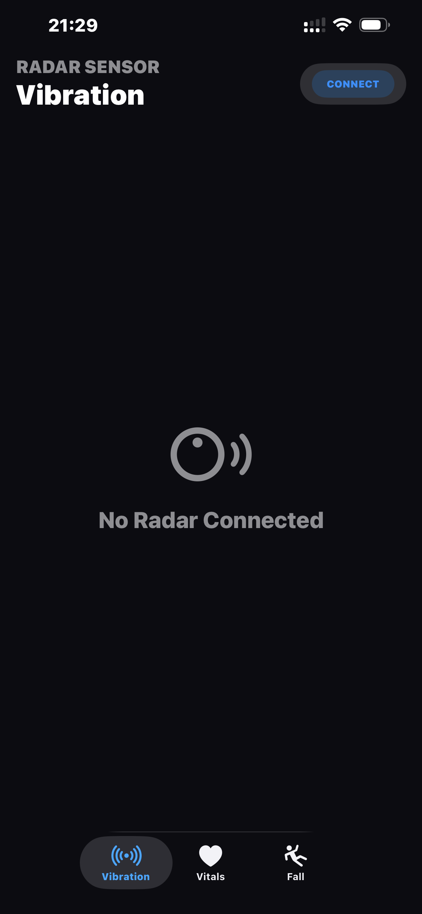
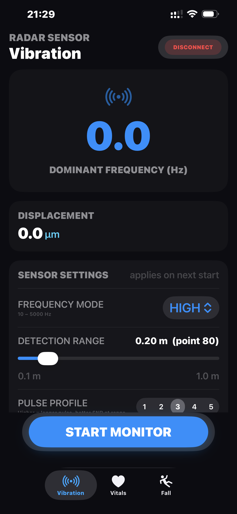
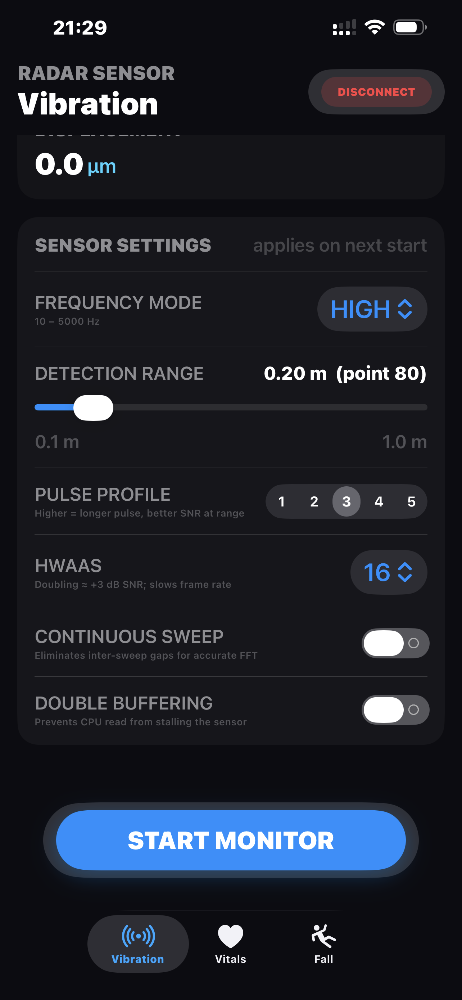
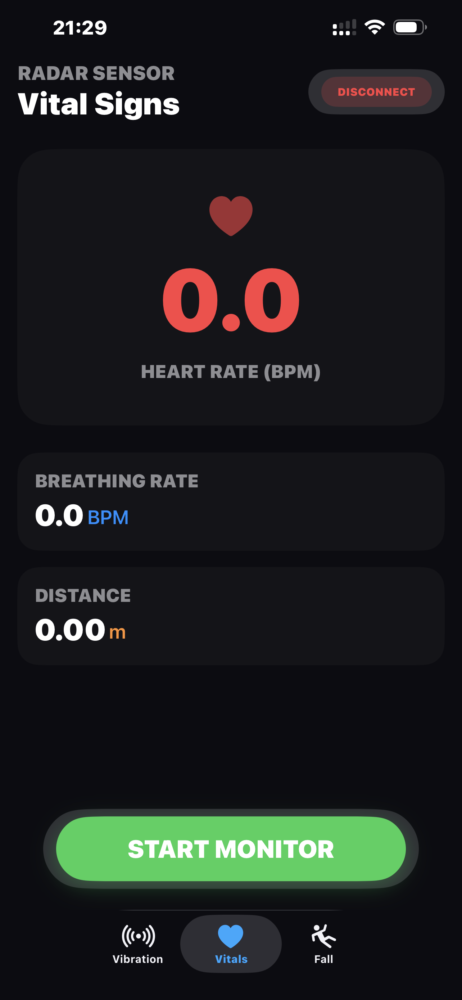

# Radar Sensor — User Guide

---

## 1. What Is This Device?

This is a compact, wireless radar sensor that monitors vibration and vital signs without any physical contact. It connects to your iPhone over Bluetooth and streams real-time measurements to the app.

**What it can do:**

| Mode | What you will see |
|---|---|
| Vibration | Live frequency (Hz) and displacement (µm) of a vibrating surface |
| Vital Signs | Breathing rate and heart rate, measured from a distance |
| Fall Detection | *(Coming soon)* |

The sensor runs on a built-in rechargeable battery and charges over USB.

<table>
  <tr>
    <td align="center"> <em>(front)</em></td>
    <td align="center"> <em>Radar sensor (back)</em></td>
  </tr>
</table>

---

## 2. Getting Started

### Power On

Turn the sensor on. The status LED will light up briefly to confirm it is powered.

### Install the App

Install **RadarPro** on your iPhone. The app requires iOS 16 or later and Bluetooth to be enabled.

### First-Time Connection

1. Open the app and go to the **Vibration** or **Vital Signs** tab.
2. Tap **CONNECT** in the top-right corner.
3. The app scans automatically and connects to the first sensor it finds.
4. The button changes to **DISCONNECT** once connected — you are ready.

> 💡 Keep the sensor within about 5 metres of your phone during setup. Once connected, the Bluetooth link is stable up to typical room distances.

---

## 3. Vibration Monitoring

Use this mode to measure mechanical vibrations on a surface — motors, pipes, machinery, structural elements, or anything that vibrates.

### Setting Up

1. Place or aim the sensor so it faces the surface you want to measure.
2. Tap the **Vibration** tab.
3. Connect if not already connected.

### Sensor Settings

Before starting a measurement, you can adjust the settings in the **SENSOR SETTINGS** panel. Changes apply the next time you tap **START MONITOR**.

| Setting | What it does |
|---|---|
| **Frequency Mode** | **HIGH** — detects 10 to 5000 Hz vibrations (motors, machinery). **LOW** — detects 0.1 to 100 Hz vibrations (slow structural movement, low-speed equipment). |
| **Detection Range** | The distance from the sensor to the target surface. Slide to match your actual setup — from 0.1 m up to 1.0 m. |
| **Pulse Profile** | Controls how much radar energy is sent out. Use higher values (4–5) for targets further away to get a stronger signal. |
| **HWAAS** | Controls how much internal averaging the radar does per measurement. Higher values improve signal quality at longer distances. Default (16) works well up to about 0.2 m. Use 64 or higher beyond 0.5 m. |
| **Continuous Sweep** | Keeps the sweep timing perfectly uniform — required for accurate frequency readings. Automatically ON in Low Frequency mode. |
| **Double Buffering** | Prevents any gaps in the data stream. Must be used together with Continuous Sweep. Automatically ON in Low Frequency mode. |

> 💡 **For targets beyond 0.5 m:** set HWAAS to 64 or higher, Pulse Profile to 4 or 5, and turn on both Continuous Sweep and Double Buffering together. These four settings work as a group to maintain signal quality at longer range.

### Reading the Results

| Reading | What it means |
|---|---|
| **Frequency (Hz)** | The dominant vibration frequency detected at your target distance. |
| **Displacement (µm)** | How far the surface is physically moving back and forth at that frequency, in micrometres (millionths of a metre). A higher number means stronger vibration amplitude. |

The display updates roughly 10 times per second. The readings are filtered — the app only shows a value once the measurement has been stable for a few consecutive frames, so you may see a short delay before the first reading appears.

If the display shows **0.0**, the sensor is not detecting a clear vibration at the current settings. Try adjusting the detection range to match your target distance more closely.

<table>
  <tr>
    <td align="center"></td>
    <td align="center"></td>
    <td align="center"></td>
  </tr>
</table>

### Starting and Stopping

- Tap **START MONITOR** to begin measuring.
- Tap **STOP SENSOR** to stop. The sensor powers down its radar to save battery.
- Any settings change while the sensor is running takes effect only after a stop-and-restart.

---

## 4. Vital Signs Monitoring

Use this mode to measure breathing rate and heart rate from a distance — no contact required. The person being monitored should be seated or lying still, facing the sensor.

### Setting Up

1. Place the sensor on a stable surface, aimed at the person's chest at a distance of approximately 0.5 to 2.5 metres.
2. The person should remain as still as possible — avoid talking or large movements during measurement.
3. Tap the **Vitals** tab, connect, then tap **START MONITOR**.

### Reading the Results

| Reading | What it means |
|---|---|
| **Heart Rate (BPM)** | Beats per minute. The large number shown in the centre of the screen. |
| **Breathing Rate (BPM)** | Breaths per minute. |
| **Distance (m)** | The estimated distance to the person being monitored. |

<table>
  <tr>
    <td align="center"></td>
  </tr>
</table>

> ⚠️ **This device is not a medical instrument.** The vital sign readings are for general monitoring and research purposes only. Do not use them for clinical diagnosis or medical decisions.

### Tips for Better Readings

- Reduce ambient movement in the room — the radar picks up any motion in its field of view.
- Keep the sensor aimed at the chest area rather than the head or legs.
- Allow 10–15 seconds after tapping START for the readings to stabilise.

---

## 5. Fall Detection

> 🚧 **This feature is under development** and will be available in a future update. The Fall Detection tab currently shows a placeholder screen.

---

## 6. Tips and Best Practices

### Vibration Measurements

- **Match the detection range to your actual target distance.** The slider in the settings panel sets the exact point the radar analyses — if it does not match where your target is, the signal will be weak or absent.
- **Start with the default settings** (High Frequency, 0.2 m, HWAAS 16, Profile 3) and adjust from there.
- **Low Frequency mode is for slow vibrations only** (below 100 Hz). Do not use it for motors or machinery running above 100 Hz — the readings will be incorrect.
- **Avoid pointing the sensor at a glass surface** — radar reflections from glass can be inconsistent.

### Vital Signs Measurements

- The subject should breathe normally and avoid talking during the measurement.
- A clear line of sight between the sensor and the subject's chest produces the best results.
- Large metal objects between the sensor and the subject can interfere with the signal.

### General

- The sensor automatically powers off its radar between sessions to extend battery life. You will not see any radar activity until you tap START.
- If the BLE connection drops, tap CONNECT again — the sensor continues to advertise and is ready to reconnect immediately.

---

## 7. Troubleshooting

| Problem | What to try |
|---|---|
| App cannot find the sensor | Make sure Bluetooth is enabled on your iPhone. Ensure the sensor is powered on. Move the phone closer to the sensor and tap CONNECT again. |
| CONNECT button shows "Scanning..." but never connects | The sensor name must contain "test_sensor". Check the sensor is on. Restart Bluetooth on your phone if needed. |
| Vibration display shows 0.0 after starting | Verify the Detection Range slider matches the actual distance to the target. Increase HWAAS (try 64) and Pulse Profile (try 4–5). Check that the surface is actually vibrating at a measurable amplitude. |
| Readings are unstable or flickering | The stability filter requires 3 consistent frames before reporting. Some flickering is normal when vibration is at the threshold. Try increasing HWAAS to improve signal quality. |
| Vital sign readings do not appear | Make sure the subject is within 0.5–2.5 m and facing the sensor. Reduce motion in the room. Allow 15 seconds for the algorithm to stabilise. |
| Sensor seems unresponsive after STOP | The STOP command can take up to one frame period (~100 ms) to take effect. If the sensor appears stuck, disconnect from the app — this halts all sensor activity immediately. |
| Settings change did not take effect | Settings are sent to the sensor only when you tap START. Stop the measurement, adjust the setting, then tap START again. |

---